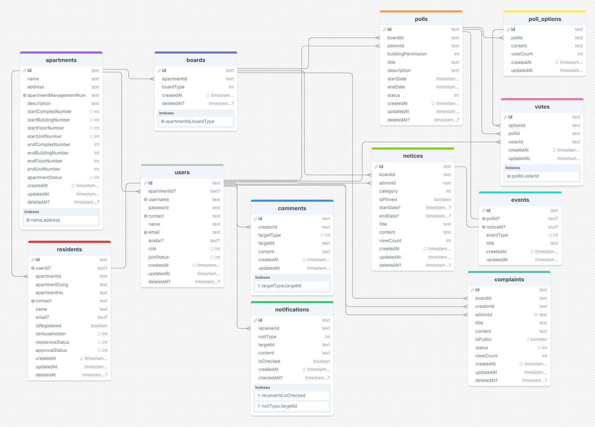

# WELIVE: 개인 프로젝트

계획서: https://www.notion.so/WELIVE-313a0d5530a580b78ddfde22eb1ec072?source=copy_link

서버: http://13.125.213.35/apartments/public

## 프로젝트 소개

- CODEIT 교육용 백엔드 시스템
- 기간: 2026.02.13 ~ 2026.04.01
- 아파트 관리를 위한 최고관리자, 관리자, 입주민 간의 상호관리 플랫폼

# WELIVE: 개인 프로젝트

계획서: https://www.notion.so/WELIVE-313a0d5530a580b78ddfde22eb1ec072?source=copy_link

서버: http://13.125.213.35

## 프로젝트 소개

- CODEIT 교육용 백엔드 시스템
- 기간: 2026.02.13 ~ 2026.04.01
- 아파트 관리를 위한 최고관리자, 관리자, 입주민 간의 상호관리 플랫폼

### 기술 스택

- Backend: Express.js, Prisma ORM
- Database: PostgreSQL
- Infrastructure: AWS EC2, RDS, S3

- Authentication: JWT (Access/Refresh), middleware
- Validation: custom validation middleware
- Realtime: Server-Sent Events (SSE)
- Scheduling: node-cron

- Testing: Jest, Supertest
- DevOps: Git, GitHub Actions (CI/CD)
- Collaboration: Notion, Discord

#### 시스템 설계

(자신이 개발한 기능에 대한 사진이나 gif 파일 첨부)

- 인증/인가 방식
  - JWT, 쿠키헤더
  - Access/Refresh 토큰 구조
  - 미들웨어/서비스단 이중 인가 처리 방식: 역할 기반 권한(RBAC)과 도메인 기반 검증을 결합하여 접근 제어 수행
  - 로그인 시 JWT Access/Refresh 토큰이 발급되며 쿠키 헤더를 통해 전달
    [로그인 API - JWT 토큰 발급 응답]
    

  - 요청은 라우터에서 parameters, body, query에 대한 1차 검증 및 RBAC 수행
    - 서비스 레이어에서 도메인 기반 권한 및 로직 검증 수행 (박스 표시 부분)
    [라우터에서 요청 검증 및 사용자 역할 기반 인가 수행(좌), 서비스 레이어에서 도메인 기반 권한 검증 수행(우)]

- 데이터 관리 전략
  - Soft Delete
  - Transaction
  - Validation middleware
    [미들웨어를 활용한 요청 파라미터/바디/쿼리 검증]
    

  - Error Handling middleware

- 스케줄링 / 실시간 알림
  - SSE
  - cron

- 현재 API는 단일 버전으로 운영되며, 향후 확장을 고려하여 버전 관리 구조 도입이 가능하도록 설계

#### 기능 상세

- User 회원별 권한 관리
  - 최고관리자: 관리자/아파트 승인/수정/거절/삭제
  - 사용자: 민원과 댓글 생성/수정/삭제, 투표 참여, 민원/공지/이벤트/투표 조회
  - 관리자: 사용자/입주민 승인/거절/삭제, 공지/투표/이벤트 생성/조회/삭제, 민원 조회/상태변경/삭제, 댓글 생성/수정/삭제

- 입주민 명부와 사용자 계정 간의 유기적 관리
  - 승인의 주체: 입주민 명부
  - welive 활동 권한의 주체: 사용자 계정

- 입주민 사용자 계정 등록 절차 다원화
  - 발생 가능한 다양한 케이스 처리 (예: 명부에서 승인된 입주민이 사용자 계정 가입 신청)
  - 적절한 에러 반환

- 관리자와 입주민 간 양방향 소통을 위한 민원과 댓글 기능 활용

- DB 일관성, 무결성을 위한 트랜잭션 사용
  - 예: 관리인 등록: 아파트 생성(Pending) → 보드 생성 → 관리자 등록(Pending) → 알림 생성
  - 알림 생성 후 SSE 발송: 외부 I/O(SSE)는 트랜잭션 외부에서 실행하여 DB 일관성과 성능 분리

- Cron을 이용한 두 가지 유형의 일정 관리
  - (1) 시스템 레벨: systemScheduler - 투표 종료 점검 및 처리
  - (2) 사용자 레벨: notiSSE - 요청에 의해 시작되며 매 30초마다 안 읽은 알림 SSE 발송
  - 중복 실행 방지: boolean flag 기반 lock (예: isPollClosureRunning)

- 아파트 일정 관리
  - 투표(생성 시)와 날짜가 존재하는 공지로 구성

### 파일 구조

- src (feature-based structure)
  - module/ (domain-based features)
  - lib/
  - middleware/
  - scheduler/
  - storage/

- prisma
  - schema.prisma
  - seed

- test
  - unit/
  - integration/
  - api/

- dist (build output)

### 배포 및 운영

- infra/EC2/
  - setup.sh
  - nginx.conf
  - ecosystem.config.js

- CI/CD
  - GitHub Actions: .github/workflows/

- File Storage
  - EC2 local storage: /welive/files/ (CSV import files for bulk resident registration)
  - AWS S3 storage: /welive/ (user avatar image upload and access)

## ERD

## 구현 홈페이지: http://13.125.213.35/apartments/public

## 프로젝트 회고록
  - 따로 첨부 에정

