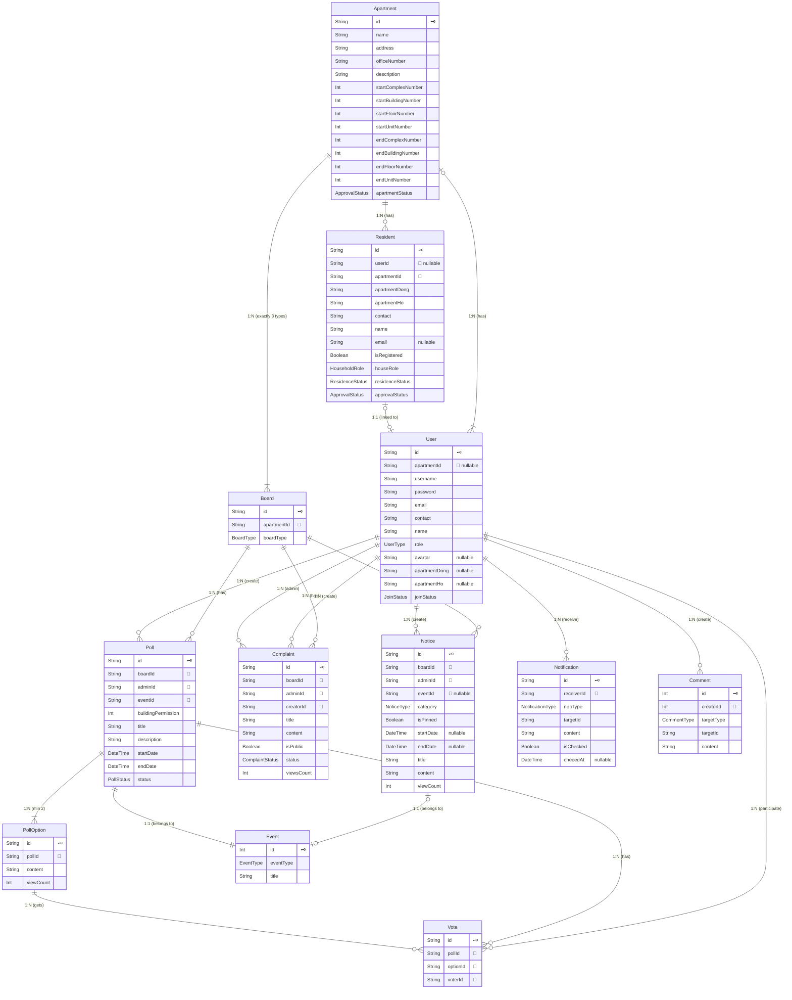

```mermaid
%%{init: { "theme": "default" }}%%
erDiagram

  "User" {
    String id "🗝️"
    String apartmentId  "🔗 nullable"
    String username
    String password
    String email
    String contact
    String name
    UserType role
    String avartar "nullable"
    String apartmentDong "nullable"
    String apartmentHo "nullable"
    JoinStatus joinStatus
  }

  "Resident" {
    String id "🗝️"
    String userId "🔗 nullable"
    String apartmentId "🔗"
    String apartmentDong
    String apartmentHo
    String contact
    String name
    String email "nullable"
    Boolean isRegistered
    HouseholdRole houseRole
    ResidenceStatus residenceStatus
    ApprovalStatus approvalStatus
  }

  "Apartment" {
    String id "🗝️"
    String name
    String address
    String officeNumber
    String description

    Int startComplexNumber
    Int startBuildingNumber
    Int startFloorNumber
    Int startUnitNumber
    Int endComplexNumber
    Int endBuildingNumber
    Int endFloorNumber
    Int endUnitNumber
    ApprovalStatus apartmentStatus

    %% UNIQUE (name, address)
  }

  "Board" {
    String id "🗝️"
    String apartmentId "🔗"
    BoardType boardType

    %% UNIQUE(apartmentId, boardType)
  }

  "Notice" {
    String id "🗝️"
    String boardId "🔗"
    String adminId "🔗"
    String eventId "🔗 nullable"
    NoticeType category
    Boolean isPinned
    DateTime startDate "nullable"
    DateTime endDate "nullable"
    String title
    String content
    Int viewCount
    }

  "Complaint" {
    String id "🗝️"
    String boardId "🔗"
    String adminId "🔗"
    String creatorId "🔗"
    String title
    String content
    Boolean isPublic
    ComplaintStatus status
    Int viewsCount
    }

  "Poll" {
    String id "🗝️"
    String boardId "🔗"
    String adminId "🔗"
    String eventId "🔗"
    Int buildingPermission
    String title
    String description
    DateTime startDate
    DateTime endDate
    PollStatus status
  }

  "PollOption" {
    String id "🗝️"
    String pollId "🔗"
    String content
    Int viewCount
  }

  "Vote" {
    String id "🗝️"
    String pollId "🔗"
    String optionId "🔗"
    String voterId "🔗"

    %% UNIQUE(pollId, voterId)
  }

  "Notification" {
    String id "🗝️"
    String receiverId "🔗"
    NotificationType notiType
    String targetId
    String content
    Boolean isChecked
    DateTime checedAt "nullable"

    %% INDEX (notiType, targetId)
    %% INDEX (receiverId, isChecked)
  }

  "Comment" {
    Int id "🗝️"
    Int creatorId "🔗"
    CommentType targetType
    String targetId
    String content

    %% INDEX (targetType, targetId)
  }

  "Event" {
    Int id "🗝️"
    EventType eventType
    String title
  }

    "Apartment" o|--|{ "User" : "1:N (has)"
    "Apartment" ||--o{ "Resident" : "1:N (has)"
    "Apartment" ||--|{ "Board" : "1:N (exactly 3 types)"
    "Resident" o|--o| "User" : "1:1 (linked to)"

    "Board" ||--o{ "Complaint" : "1:N (has)"
    "Board" ||--o{ "Poll" : "1:N (has)"
    "Board" ||--o{ "Notice" : "1:N (has)"

    "User" ||--o{ "Poll" : "1:N (create)"
    "User" ||--o{ "Vote" : "1:N (participate)"
    "Poll" ||--o{ "Vote" : "1:N (has)"
    "Poll" ||--|{ "PollOption" : "1:N (min 2)"
    "PollOption" ||--o{ "Vote" : "1:N (gets)"

    "User" ||--o{ "Notice" : "1:N (create)"
    "User" ||--o{ "Complaint" : "1:N (create)"
    "User" ||--o{ "Complaint" : "1:N (admin)"
    "User" ||--o{ "Comment" : "1:N (create)"
    "User" ||--o{ "Notification" : "1:N (receive)"

    "Notice" o|--o| "Event" : "1:1 (belongs to)"
    "Poll" ||--|| "Event" : "1:1 (belongs to)"

```
